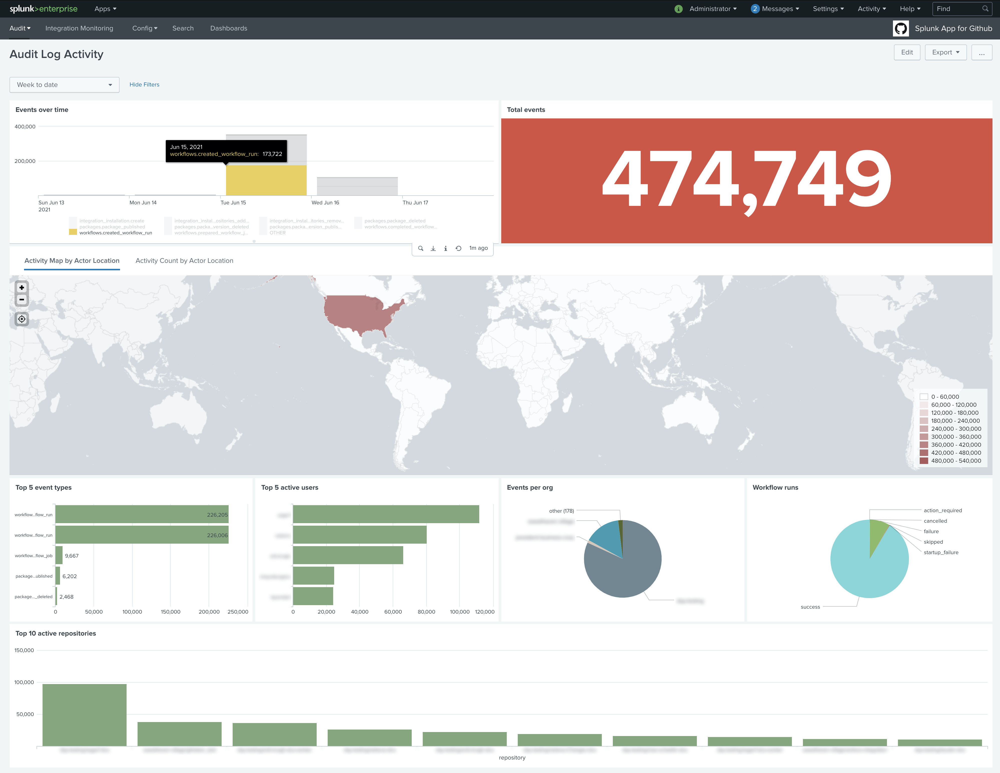

# GitHub Enterprise Audit Log Monitoring

> Splunk modular input plugin to fetch the enterprise audit log from GitHub Enterprise

Support for modular inputs in Splunk Enterprise 5.0 and later enables you to add new types of inputs to Splunk Enterprise that are treated as native Splunk Enterprise inputs.

This modular input makes an HTTPS request to the GitHub Enterprise's Audit Log REST API endpoint at a definable interval to fetch audit log data.


## Prerequisites

- Splunk Heavy Forwarder v8.0+
- Python 3.7+
- GitHub Enterprise Cloud

## Installation

1. Download the latest release from [Splunkbase](https://splunkbase.splunk.com/app/5595/).

1. On a Splunk heavy forwarder, go to **Apps** > **Manage Apps**.

1. On the **Apps** page, click **Install app from file**, and upload the SPL file you downloaded from Splunkbase. If an existing copy of the app already exists, check the **Upgrade app** checkbox.

1. Generate a Personal Access Token in GitHub Enterprise with the `site_admin` scope.

## Configuration

### Personal Access Token Scope

These are the required scopes for the personal access token allowing the module to fetch the audit log entries successfully:

- [x] admin:enterprise `Full control of enterprises`
  - [x] manage_billing:enterprise `Read and write enterprise billing data`
  - [x] read:enterprise `Read enterprise profile data`

### Input Fields


- **name**

  - This is name of your instance. You can have multiple modular inputs running simultaneously. However, this isn't recommended for this module.
  - Accepts: alpha-numeric, white spaces, and symbol characters
  - Example: `GHE-enterprise-name`

- **Hostname**

  - This is the hostname of your GitHub Enterprise instance. Make sure there are no leading protocols (e.g. `http://`/`https://`) or trailing slashes (`/`) in the URL provided. This could either be a FQDN or an IP address. Don't append paths beyond the TLD.
   - Example: [api.github.com](https://api.github.com)

- **Enterprise**

  - The enterprise name for which to fetch audit log events.

- **Personal Access Token**

  - This is your personal access token that you generate for your account or a service account in GitHub Enterprise. This module requires that you create the personal access token with the `site_admin` scope. This is a very sensitive token so make sure to keep it secure at all times!
  - Security: The personal access token is encrypted and stored in Splunk's password storage. After you configure it the first time it will be replaced in Splunk's UI with a unique identifier. This identifier will be used by the module to fetch the personal access token before making the API request to GitHub Enterprise.
  - Accepts: a 40-character token
  - Example: `d0e117b6ad471der3rjdowcc401a95d09202119f`

- **Event Types**

  - The audit log contains multiple event types. This field allows you to specify which events to include:
    - web: returns web (non-Git) events
    - git: returns Git events
    - allL returns both web and Git events
  - Go to the [Splunk docs](https://docs.github.com/en/rest/reference/enterprise-admin#get-the-audit-log-for-an-enterprise) for more details.

- **Maximum Entries Per Run**

  - The maximum number of events / entries to fetch each time the script runs. To understand how to calculate the maximum number of entries and interval to best fit your organization, go to the [Tweaking throughput](#tweaking-throughput) section.

- **Verify Self-Signed Certificates**

  - This is a parameter passed to the `get()` method in the `Requests` library. If the checkbox is cheked then the SSL certificate will be verified like a browser does and requests will throw a SSLError if it’s unable to verify the certificate. Uncheck this box if you are using **self-signed certificates**.

- **Debug Mode**

  - The personal access token will be leaked in the splunkd logs. **DO NOT ENABLE** unless you are ready to update your personal access token.
  - If you are experiencing issues and the module isn't operating as intended, you can enable this mode to see the module's debugging information in the `splunkd` logs.

- **Interval**

  - Takes a `cron expression` as defined in the [Splunk docs](https://docs.splunk.com/Documentation/Splunk/8.1.0/Alert/CronExpressions).
  - Example: `30 * * * *`
    - At minute 30 of every hour. For example, if you set this CRON job at 11:02, your job will begin running at 11:30, 12:30, 1:30, etc...
  - Example: `*/5 * * * *`
    - Every 5 minutes
  - Example: `300`
    - Every 300 seconds or 5 minutes

### Tweaking throughput

This modular input fetches events by calling the [Enterprise Audit Log API](https://docs.github.com/en/rest/reference/enterprise-admin#get-the-audit-log-for-an-enterprise). This API returns a maximum of 100 events / entries per page. The pagination algorithm can fetch events up to the maximum entries per run you defined. It's important to tweak the `maximum entries per run` and `interval` parameters to have the ability to fetch your data in a timely manner and stay `as close` to real time as possible.

**Example:**
| Enterprise   | Events per minute | Maximum entries per run | Interval    | API calls used | Guidance                                                                                                                                                               |
|--------------|-------------------|-------------------------|-------------|----------------|------------------------------------------------------------------------------------------------------------------------------------------------------------------------|
| Evil-Corp    | 1000              | 1000                    | */1* ** * | 600 per hour   | The modular input should be able to handle this with ease.                                                                                                             |
| Poizen-Inc   | 5000              | 5000                    | */1* ** * | 3000 per hour  | We are approaching API rate limit per hour.  Depending on latency, 5000 entries = 50 API calls per minute.  One minute might not be sufficient to fetch all this data. |
| Monsters-Inc | 10000             | 2000                    | */1* ** * | 1200 per hour  | You will be fetching events with a slight delay.                                                                                                                       |

## Use cases

### Github App for Splunk

Along with this modular input we're providing a [Github App for Splunk](https://splunkbase.splunk.com/app/5596/) that makes use of the collected audit log events to give you an overview of the activities across your enterprise.

You can install it via the [Manage Apps page](https://docs.splunk.com/Documentation/Splunk/8.2.0/Admin/Deployappsandadd-ons).

Make sure to replace the `[STANZA_NAME]` placeholder with the name of your modular input instance (the first field in the input parameters configured in the previous section).



## FAQs

### How is my Personal Access Token secured?

On the first run the modular input will identify that your personal access token (PAT) isn't encrypted. It will encrypt your PAT and store it in Splunk's credentials manager. It will replace the plain text PAT with an md5 hash of an identifying key.

Your personal access token is only visible in plain text from the time you configure the modular input instance until the first run.

### Does the interval field access only cron syntax?

No, you can enter the number of seconds instead.

### I enabled debug mode, what now?

If you've enabled debug mode be ready to change your personal access token because it will most likely be leaked into the Splunk logs in plain text.

### Why can't I use a GitHub app instead of a personal access token?

GitHub apps can't be installed on the enterprise level. The REST API requires enterprise admin privileges which are out of scope for GitHub apps.

### Can I use this with GitHub Enterprise Server?

This tool has been designed to consume the [Enterprise Audit Log API](https://docs.github.com/en/rest/reference/enterprise-admin#audit-log) which is not available for GitHub Enterprise Server because the audit log on the latter can be forwarded via [log forwarding](https://docs.github.com/en/enterprise-server/admin/user-management/monitoring-activity-in-your-enterprise/log-forwarding#enabling-log-forwarding) directly to Splunk without the need to poll for data.

## Support

Support for Github Audit Log Monitoring Add-On for Splunk is run through [Github Issues](https://github.com/splunk/github-audit-log-monitoring-add-on-for-splunk/issues). Open a new issue for any support issues or for feature requests. You may also open a pull request if you'd like to contribute additional dashboards, eventtypes for webhooks, or enhancements.

## Troubleshooting

### Read logs in Splunk

You can use this search query to fetch all the logs belonging to this module when **Debug Mode** is enabled.

```sh
index="_internal" source="/opt/splunk/var/log/splunk/splunkd.log" ghe_audit_log_monitoring
```

### Test the modular input for syntax problems

Run this test if you don't see anything in the logs (which is a highly unlikely scenario). This will display any syntax errors if there are any.

```sh
sudo $SPLUNK_HOME/bin/splunk cmd python $SPLUNK_HOME/etc/apps/ghe_audit_log_monitoring/bin/ghe_audit_log_monitoring.py
```

### Where are state files stored?

State files for enterprises are stored in this directory:

```sh
$SPLUNK_HOME/etc/apps/ghe_audit_log_monitoring/state/
```
